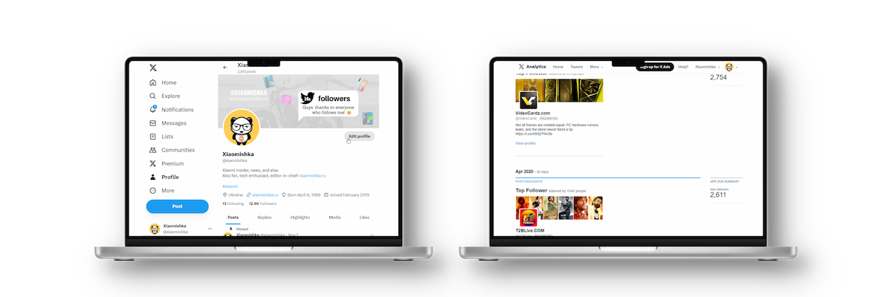

<h1 align="center">Hi there, my name is Sergey </h1>

- 🔭 More than **3 years** of hands-on experience in _frontend development_, building responsive and user-friendly web interfaces.  
- 😎 Currently working on personal IT projects and **open to exciting new opportunities** 😊  
- 📚 Dedicated to **daily learning** in frontend development to sharpen my skills and stay up-to-date.  
- 🌱 Currently focused on mastering **Next.js**, **TypeScript**, **modern React (v19)**, and exploring **AI Agent SDK** to build intelligent web experiences.  
- 🚀 Built several personal projects, including a real-time AI assistant and interactive UIs.  
- 🤝 Team player | 💡 Problem-solver | 🌍 Open to collaboration and open-source contributions

🔥 Latest projects built with Next.js 15 and AI:

- [Pytai](https://github.com/getFrontend/app-ai-interviews) is AI-powered real-time interview platform for smarter hiring.
- [Four in One](https://github.com/getFrontend/app-game-four-in-one) is a classic connect four in a row game where you can testing your skills against a clever AI.
- [Imagenko](https://imagenko.vercel.app/) is an AI-powered image generator, based on Cloudinary.

As well as some other useful repos and last full-stack applications on Next JS:

- [Center DIV](https://github.com/getFrontend/app-center-div) is interactive educational web app.
- [Diffly](https://github.com/getFrontend/app-diffly) is a useful Text comparison tool.
- [Tulip Index](https://github.com/getFrontend/app-tulip-index) is a multilingual app to analyze tulip prices.
- [ChatGPT AD maker](https://chatgpt-admaker.vercel.app/) is app for editing pointillism style images.
- [POOM](https://github.com/getFrontend/next-app-zoom-clone) is a Video call app.
- [FigMan](https://figman.vercel.app/) is a drawing app.
- [TopAIprompts](https://top-aiprompts.vercel.app/) is a library for collecting prompts.

One of the latest projects on React are: [iPhone](https://iphone16.vercel.app/) clone site, [BrainMaster](https://brainmaster.vercel.app/) modern website with sleek parallax effects and bento box layouts, an [online-shop MEBL](https://mebl-shop.vercel.app/) with a wide range of features and a [Kanban board](https://u-kanbanboard.vercel.app/ "Kanban board") that helps you organise your task list.

## My tech stack

                 

## Intresting fact about me

At the beginning of 2018, I started developing the [Xiaomishka](https://twitter.com/xiaomishka "Xiaomishka") project from scratch. By the end of the year, the project became one of the most visited and authoritative Xiaomi resources in the CIS, and in mid-2019 one of the most well-known and read **Xiaomi insiders**.

At that time, my publications could be found in most reputable tech publications such as: _GSMArena, Gizmochina, Gizchina, AndroidAuthority, AndroidCentral, PhoneArena, XDA-developers, Xataka, 91mobiles_ and many others.
